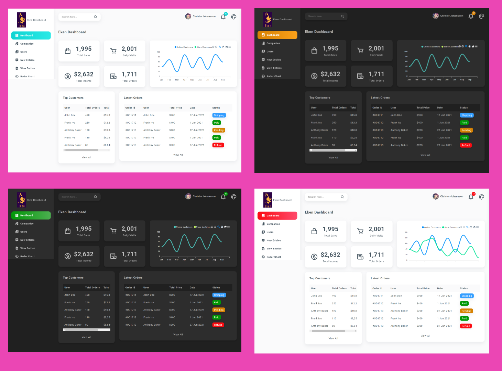
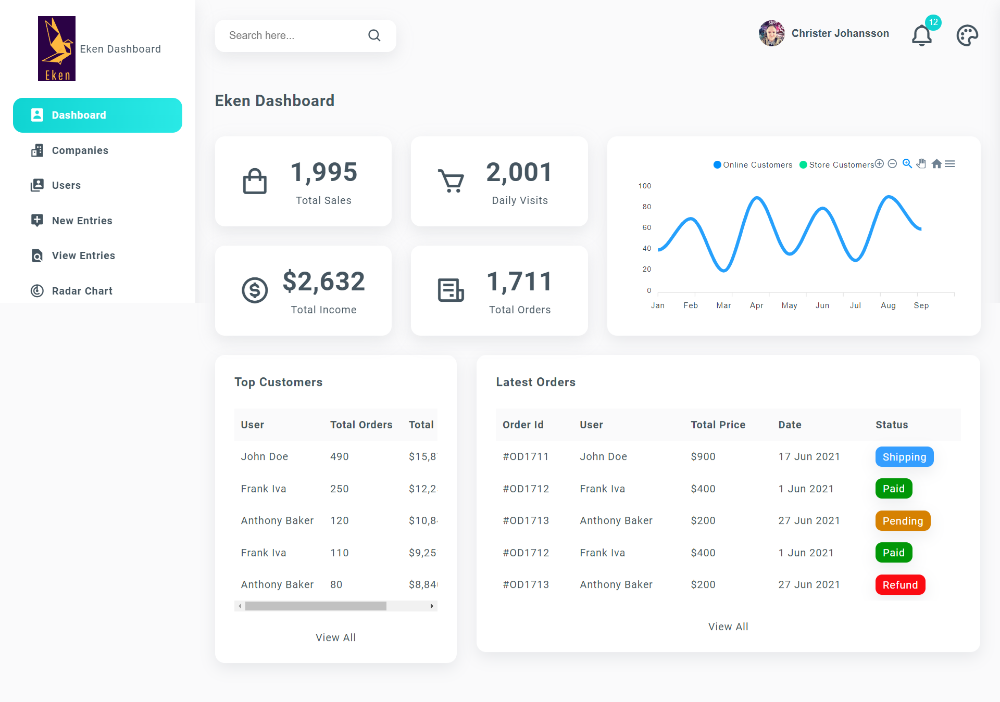
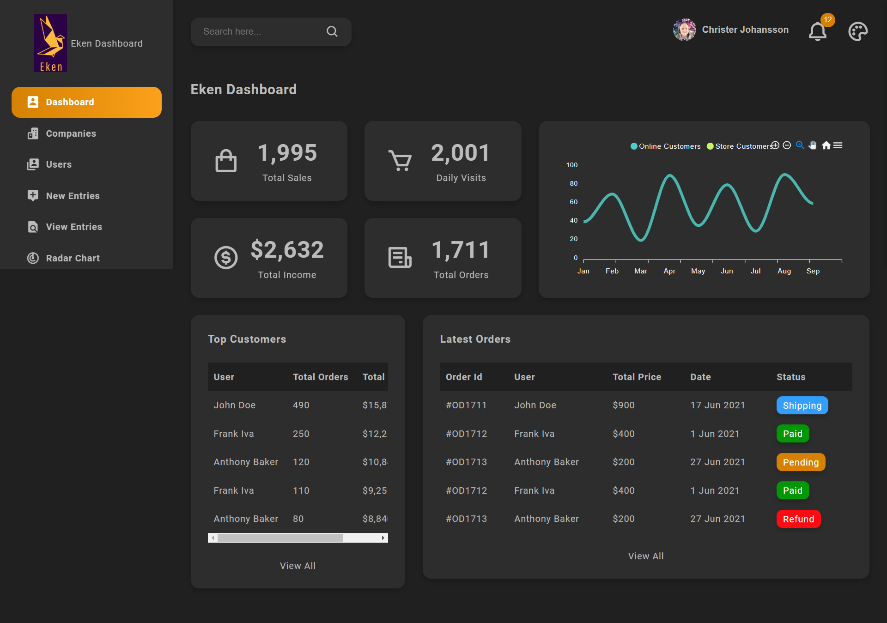

# React Admin Dashboard with Multiple Themes

Built with Create-React-App, Eken Dashboard with Multiple Themes.
# Description

Eken dashboard with multiple themes, built with ReactJS, and the framework create-react-app.

# Installation

To install and run this application, you will need NodeJS on your local machine. This app was developed with Yarn, but works equally well with NPM. 

Clone the repository into your folder, open a terminal window and run either ```yarn``` or ```npm i```.
The script will install needed packages. When done, you simply run ```npm start``` or ```yarn start```.

# Resources

- NodeJS: https://www.nodejs.org/
- ReactJS: https://reactjs.org/
- Google font: https://fonts.google.com/
- Boxicons: https://boxicons.com/
- Images: https://unsplash.com/

# Preview






